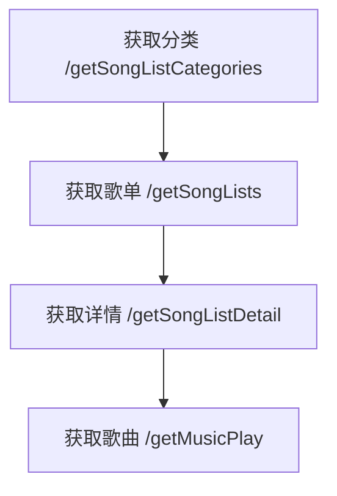

# fontend
## 项目简介
这个项目是基于一个github上的qq音乐后台进行开发的，作为练手项目，进行前端开发
后台的仓库为<a href="https://github.com/rain120/qq-music-api"> 原仓库</a>


## Project setup
```
npm install
```

### Compiles and hot-reloads for development
```
npm run serve
```

### Compiles and minifies for production
```
npm run build
```

### Lints and fixes files
```
npm run lint
```

### Customize configuration
See [Configuration Reference](https://cli.vuejs.org/config/).


### 组件分类
    1.智能组件（数据获取， 数据过滤）
    2.木偶组件（渲染视图）

### 后端接口分析

根据文档内容，我整理了QQ音乐API的完整接口列表，并按照功能分类展示。重点接口会提供从简单到复杂的调用示例。

### 一、歌单相关API

#### 1. 获取歌单分类
```http
GET /getSongListCategories
```
示例：
```bash
# 基础调用
/api/getSongListCategories

# 返回示例
{
  "code": 0,
  "data": [
    {"categoryId": 10000000, "categoryName": "热门"},
    {"categoryId": 167, "categoryName": "华语"}
  ]
}
```

#### 2. 获取歌单列表
```http
GET /getSongLists
```
参数示例：
```bash
# 基础调用（必选categoryId）
/api/getSongLists?categoryId=10000000

# 增加分页
/api/getSongLists?categoryId=167&page=2&limit=30

# 增加排序（5=最热）
/api/getSongLists?categoryId=167&sortId=5
```

#### 3. 批量获取歌单列表
```http
POST /batchGetSongLists
```
```json
{
  "categoryIds": [167, 168],
  "page": 1,
  "limit": 20,
  "sortId": 5
}
```

#### 4. 获取歌单详情
```http
GET /getSongListDetail?disstid=7011264340
```

### 二、歌曲相关API

#### 1. 获取歌曲播放链接
```http
GET /getMusicPlay
```
示例演进：
```bash
# 基础调用（必选songmid）
/api/getMusicPlay?songmid=003RMa7G0k5hKc

# 指定音质（320kbps）
/api/getMusicPlay?songmid=003RMa7G0k5hKc&quality=320

# 批量获取
/api/getMusicPlay?songmid=001yNIc41SJjuC,001wPuVc4ZiMhj
```

#### 2. 获取歌词
```http
GET /getlyric?songmid=003RMa7G0k5hKc&isFormat=true
```

### 三、歌手相关API

#### 1. 获取歌手热门歌曲
```http
GET /getSingerHotsong?singermid=0025NhlN2yWrP4
```
进阶示例：
```bash
# 分页获取
/api/getSingerHotsong?singermid=0025NhlN2yWrP4&page=2&limit=10
```

#### 2. 获取歌手MV
```http
GET /getSingerMV?singermid=0025NhlN2yWrP4&order=time&limit=5
```

### 四、搜索相关API

#### 1. 关键字搜索
```http
GET /getSearchByKey?key=周杰伦
```
复杂搜索示例：
```bash
# 搜索专辑
/api/getSearchByKey?key=周杰伦&remoteplace=album

# 分页搜索MV
/api/getSearchByKey?key=周杰伦&remoteplace=mv&page=2&limit=15
```

### 五、特色功能API

#### 1. 获取推荐内容
```http
GET /getRecommend
```

#### 2. 获取排行榜
```http
GET /getTopLists?limit=50
```

#### 3. 获取新碟
```http
GET /getNewDisks?page=2&limit=30
```

### 重点接口调用流程示例（带图示说明）

文档中提到的API结构图展示了核心调用关系：
1. 先获取分类 → 2. 再获取歌单列表 → 3. 最后获取歌单详情



### 注意事项

1. **Cookie配置**：
```javascript
// config/user-info.js
{
  "loginUin": "123456",
  "cookie": "qqmusic_key=ABCDEF..."
}
```

2. **分页参数规律**：
   - `page`: 从0或1开始（不同接口有差异）
   - `limit`: 默认通常为20

3. **重要参数说明**：
   - `quality` 音质选项：`m4a`(普通)、`128`、`320`(高品质)、`flac`(无损)
   - `sortId`: 5=最热，2=最新

建议开发时先用Postman测试接口，确认参数格式后再接入前端代码。文档中示例截图显示返回数据包含`code`、`data`等标准字段，前端应做好错误处理。